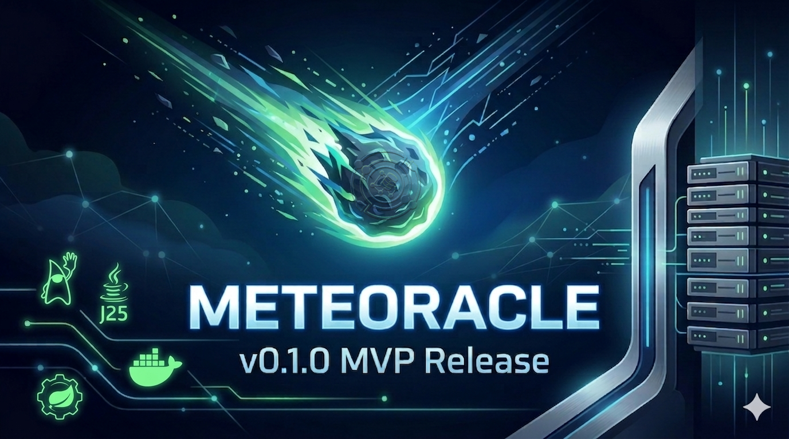

<p align="center">
  
</p>


# Meteoracle

### *The Industrial Supply Chain Interoperability Layer*

**Meteoracle** is a VDA-compliant interoperability layer designed to bridge the gap between legacy industrial ERP systems and decentralized ledgers. Built with a modular **Hexagonal Architecture**, it provides a standards-first gateway to anchor supply chain events onto the **IOTA Rebased** ledger—enabling verifiable data integrity without the complexity of direct DLT integration.

---

## 🚀 The Core Value Proposition

Meteoracle provides an **Oracle-ready** integration point for industrial firms to secure their supply chain data with **zero architectural debt**.

* **Compliance:** Native support for **VDA4994** (Global Transport Label) standards.
* **Immutability:** Tamper-proof event anchoring via **IOTA Rebased**.
* **Flexibility:** A decoupled "Ports & Adapters" design that allows for swapping ledgers or ERPs without refactoring core business logic.

---

## 🏗️ Architecture: The Hexagonal Advantage

Meteoracle is architected using the **Hexagonal (Ports & Adapters) pattern** in Spring Boot. This strategic choice ensures that the core logistics domain remains isolated from external technologies.

### 1. The Verified Ingress Gateway (Inbound)
Receives HTTP requests from industrial scanners or ERP systems. It validates incoming data against VDA4994 industrial standards before it ever touches the core logic.

### 2. The Domain Core (The Brain)
Handles the business logic of shipment milestones, ensuring data consistency and state management independent of the underlying database or ledger.

### 3. The IOTA Rebased Adapter (Outbound)
Specialized adapter that handles the complexities of DLT communication, anchoring the validated "Source of Truth" to the IOTA Rebased network.


---

## 🛠️ Tech Stack

* **Framework:** Spring Boot (Java)
* **Architecture:** Hexagonal / Ports & Adapters
* **DLT Integration:** IOTA Rebased
* **Standards:** VDA4994 (Automotive Logistics)
* **API:** RESTful

---

## 📋 Getting Started

### Prerequisites
* Java 25+
* Gradle 9.1.0+
* IOTA Rebased Testnet private key

### Build
1.  **Clone the repository:**
    ```bash
    git clone https://github.com/c8r1s7i4n/Meteoracle.git
    ```
2.  **Configure your Adapters:**
    Create .env file with the IOTA_RPC URL for the appropiate network and your private key as shown in the .env.example file.
3.  **Build:**
    In the root of the project execute
    ```bash
    ./gradlew build
    ```

### Execution
#### WAR File
1. Place the file next to your .env file.
2. Execute via standard java command: ```java -jar <path-to-war-file>```

#### Docker file
1. Download the Docker image file.
2. Load the Docker image.
3. Locate your .env file and pass it to the container creation process e.g <br> ```sudo docker run -p 8080:8080 --env-file <path-to-env-file> omnipons/meteoracle```

---

## 🤝 Contribution & Open Source

As a solo-developed project, Meteoracle is built on the principles of transparency and modularity. The **Open Source** nature of the Ingress Gateway ensures that the industrial community can audit, verify, and extend the system without vendor lock-in.

---

## ⚖️ License
This project is licensed under the **GNU Affero General Public License v3.0 (AGPL-3.0)**.

### Why AGPL?
I believe in **Architecture over Bloat**. I provide a lean, powerful core, and in return, I ask that the community keeps the ecosystem healthy.

* **Share Alike:** If you modify this software or run it as a service (SaaS), you **must** make your modified source code available to your users under the same license.
* **No "Cloud Leeching":** This license prevents large providers from taking this architecture, wrapping it in a proprietary service, and not contributing back.

---

### **Developer Note**
> *"Meteoracle was built on the principle of **'Architecture over Bloat.'** By adhering to strict Hexagonal patterns, the codebase remains lightweight, highly testable, and ready to adapt to the rapidly evolving landscape of decentralized industrial logistics."*

---
